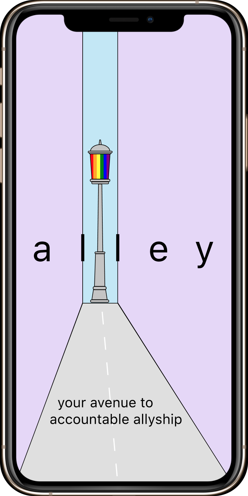
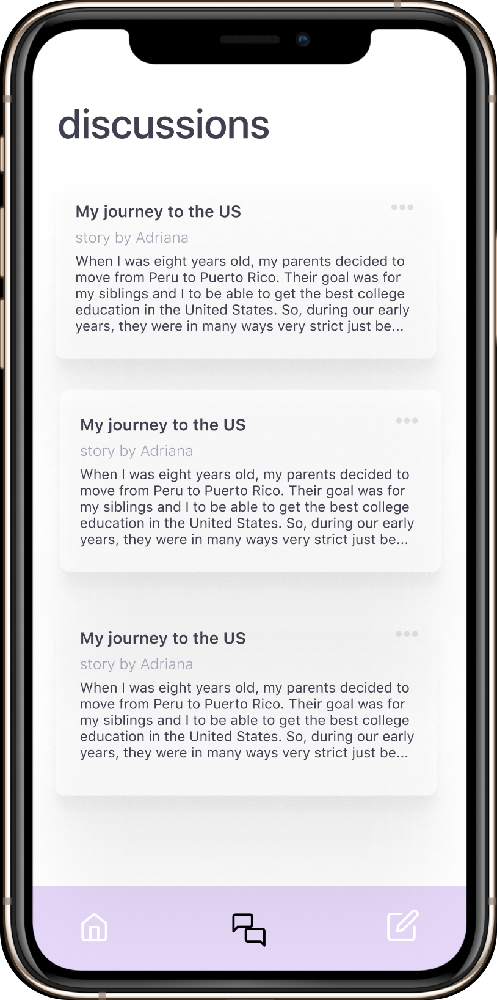

# alley

### an avenue to better allyship

Want to learn more about the experiences of people in marginalized groups to become a better ally? Want to have meaningful conversations that transcend performative activism? Time to hit the road and start using alley, your personal avenue to accountable allyship. alley is an environment where people are encouraged to share their own experiences and create open, judgement-free dialogue with others. We hope that alley can foster communities and promote a continuous growth mindset as people work towards becoming better allies. Channel your efforts today into building a better, more inclusive tomorrow with alley.

View designs here: https://www.figma.com/file/kGeijTQfgIA0VXSyFASxt9/Mobile-Iterations?node-id=165%3A56

## Features

### daily tip
A daily notification with a simple suggestion of an action you can do today to be a better ally.

### discussion boards
A safe space where people can discuss better ways to be an ally. Follow and contribute to different tabs to learn how to better support different groups.

### our stories
A place for people to share and give others insight into their personal experiences.

## User Flow
1. Splash Screen

2. Home Dashboard

3. Explore a Tag

4. Discussion Boards

5. Write a Post

## Tech Stack
### Frontend: 
Swift, XCode

### Backend:
Python, Postman, Google Cloud, Docker, Flask, SQLAlchemy
